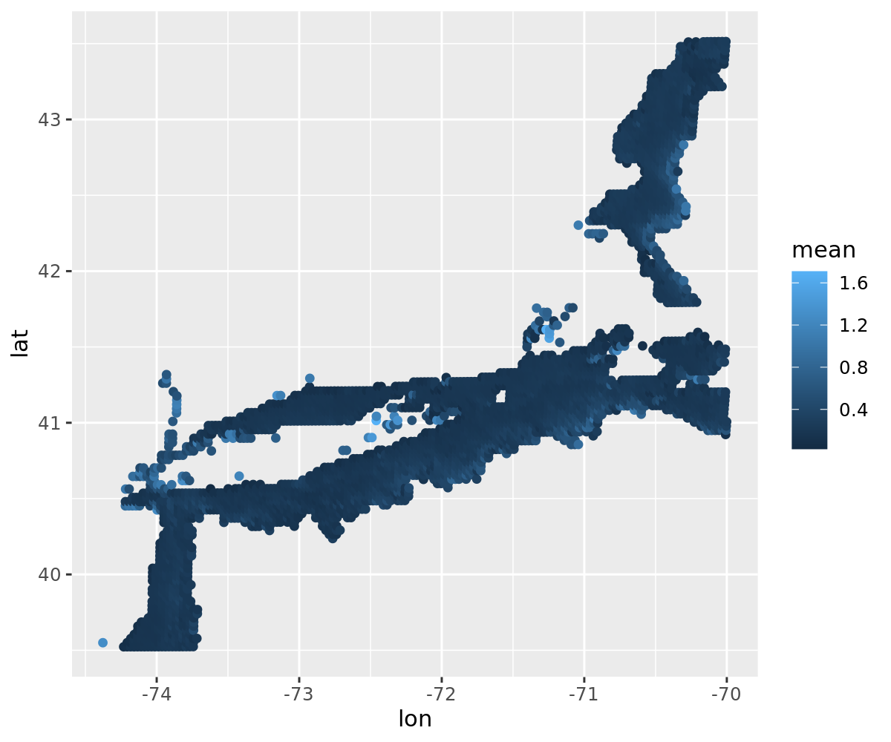

```{r setup, include=FALSE}
knitr::opts_chunk$set(echo = TRUE)
here::i_am("Rmd/report.Rmd")
```

Here's my picture:

The figure shows a large missing part both spatially and temporally because the satellite observation is based on the sunlight.It can be interfered by the image angels, weather, cloud, and time.


